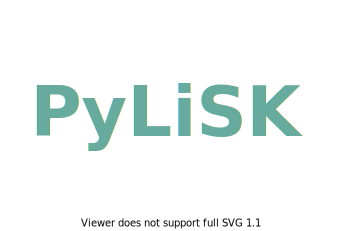

 

 

 
  
  
 
  
   
 

---

PyLiSK is a starter kit for building a Python library. It's inspired by the structure suggested in [The Hitchhiker's
 Guide to Python](https://docs.python-guide.org/writing/structure/) with more features and essential components. 
 
 ### Quick Start
 
 Get the kit starter with:
 
    git clone https://github.com/adbeda/pylisk.git
   
 
 #### Key features:
    
- PyLiSK Use the `Makefile` to run commands for
    -  testing, linting and formatting the library
    - creating the documentation and
    - cleaning up the kit before pushing it Github
- Code style formatting is done with `black`.
- Linting is achieved through `flake8`.
- The documentation uses the `read-the-docs` theme.
- Github's actions serves as the main CI tool.
- `Pytest` is used for testing via `tox`.

  

